                                                                                                                                # Suite Report

Generated: 2026-01-18T11:04:10

Suite index: outputs/suites/bench_v1/suite_index.json

## Experiment: bench_v1_color

### Pareto topk

#### pareto_000

- case: 0
- seed: 0
- edit_index: 0
- target: None
- outside_mean_abs_diff_adj: 0.0
- semantic_delta_raw: 0.057423949241638184

Conditions:

- base_prompt: a red cat on a table
- generate_prompt: a red cat on a table
- edit_base_prompt: a cat on a table
- edit_prompt: a blue cat
- semantic_text: a blue cat
- semantic_neg_text: a red cat
- mask_pad_px: 8
- mask_blur: 8.0
- strength: 0.9
- seed: 0

base_image:

edited:

null_edited:

mask:

diff:

overlay:

### Worst leakage topk

#### worst_000

- case: 1
- seed: 0
- edit_index: 0
- target: None
- outside_mean_abs_diff_adj: 0.0004303082823753357
- semantic_delta_raw: 0.043653905391693115

Conditions:

- base_prompt: a green dog in a park
- generate_prompt: a green dog in a park
- edit_base_prompt: a dog in a park
- edit_prompt: a yellow dog
- semantic_text: a yellow dog
- semantic_neg_text: a green dog
- mask_pad_px: 8
- mask_blur: 8.0
- strength: 0.9
- seed: 0

base_image:

edited:

null_edited:

mask:

diff:

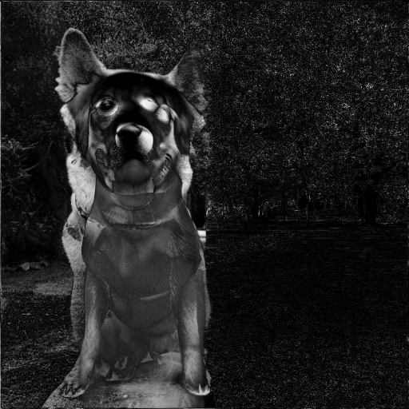

overlay:

#### worst_001

- case: 4
- seed: 0
- edit_index: 0
- target: None
- outside_mean_abs_diff_adj: 0.0002530291676521301
- semantic_delta_raw: 0.004651814699172974

Conditions:

- base_prompt: a purple bicycle leaning against a wall
- generate_prompt: a purple bicycle leaning against a wall
- edit_base_prompt: a bicycle leaning against a wall
- edit_prompt: an orange bicycle
- semantic_text: an orange bicycle
- semantic_neg_text: a purple bicycle
- mask_pad_px: 8
- mask_blur: 8.0
- strength: 0.9
- seed: 0

base_image:

edited:

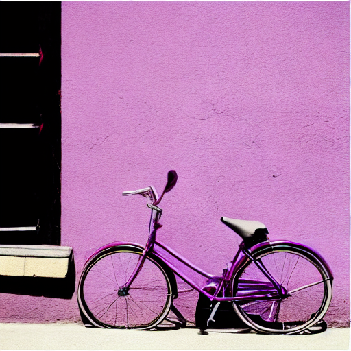

null_edited:

mask:

diff:

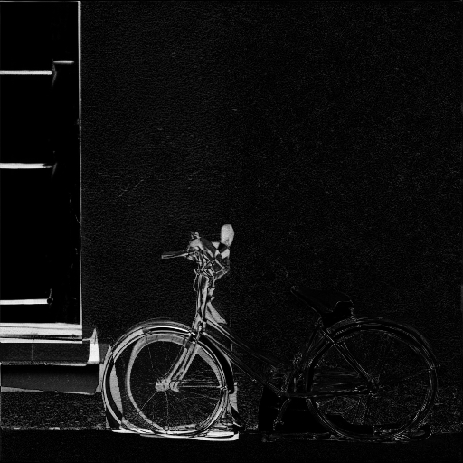

overlay:

#### worst_002

- case: 2
- seed: 0
- edit_index: 0
- target: None
- outside_mean_abs_diff_adj: 0.00011742487549781799
- semantic_delta_raw: -0.002983108162879944

Conditions:

- base_prompt: a blue car on a road
- generate_prompt: a blue car on a road
- edit_base_prompt: a car on a road
- edit_prompt: a red car
- semantic_text: a red car
- semantic_neg_text: a blue car
- mask_pad_px: 8
- mask_blur: 8.0
- strength: 0.6
- seed: 0

base_image:

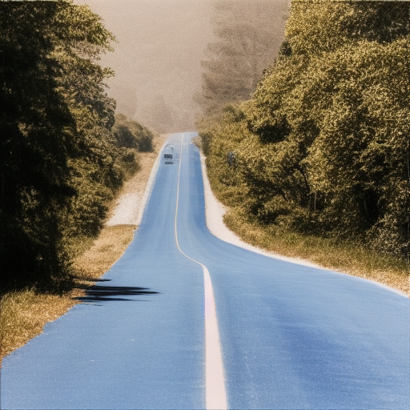

edited:

null_edited:

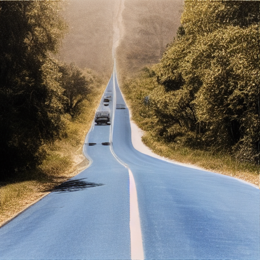

mask:

diff:

overlay:

#### worst_003

- case: 6
- seed: 0
- edit_index: 0
- target: None
- outside_mean_abs_diff_adj: 0.00010178238153457642
- semantic_delta_raw: 0.0014955699443817139

Conditions:

- base_prompt: a black mug on a desk
- generate_prompt: a black mug on a desk
- edit_base_prompt: a mug on a desk
- edit_prompt: a white mug
- semantic_text: a white mug
- semantic_neg_text: a black mug
- mask_pad_px: 8
- mask_blur: 8.0
- strength: 0.3
- seed: 0

base_image:

edited:

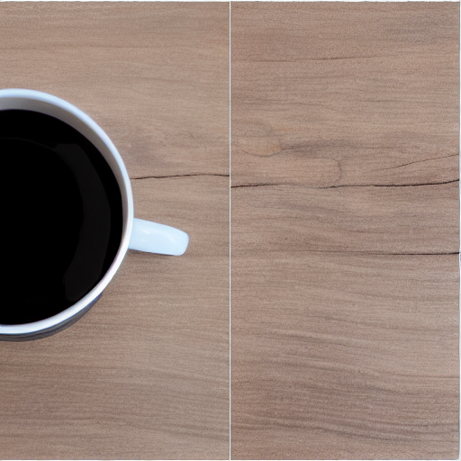

null_edited:

mask:

diff:

overlay:

#### worst_004

- case: 4
- seed: 0
- edit_index: 0
- target: None
- outside_mean_abs_diff_adj: 9.99942421913147e-05
- semantic_delta_raw: -0.0008111894130706787

Conditions:

- base_prompt: a purple bicycle leaning against a wall
- generate_prompt: a purple bicycle leaning against a wall
- edit_base_prompt: a bicycle leaning against a wall
- edit_prompt: an orange bicycle
- semantic_text: an orange bicycle
- semantic_neg_text: a purple bicycle
- mask_pad_px: 8
- mask_blur: 8.0
- strength: 0.3
- seed: 0

base_image:

edited:

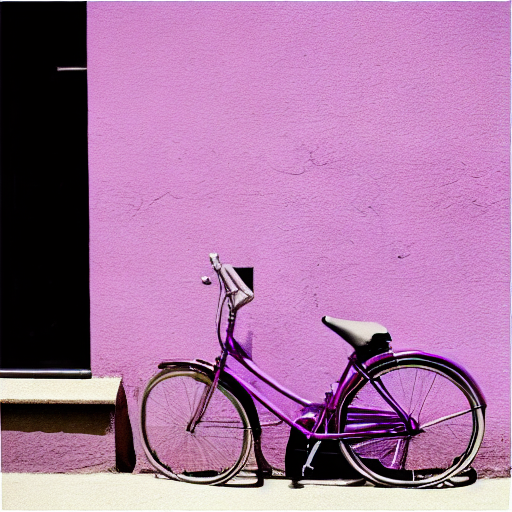

null_edited:

mask:

diff:

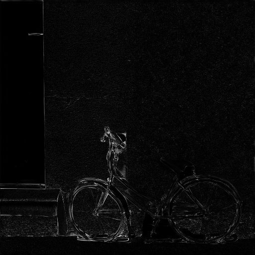

overlay:

### Best semantic topk

#### best_000

- case: 0
- seed: 0
- edit_index: 0
- target: None
- outside_mean_abs_diff_adj: 0.0
- semantic_delta_raw: 0.057423949241638184

Conditions:

- base_prompt: a red cat on a table
- generate_prompt: a red cat on a table
- edit_base_prompt: a cat on a table
- edit_prompt: a blue cat
- semantic_text: a blue cat
- semantic_neg_text: a red cat
- mask_pad_px: 8
- mask_blur: 8.0
- strength: 0.9
- seed: 0

base_image:

edited:

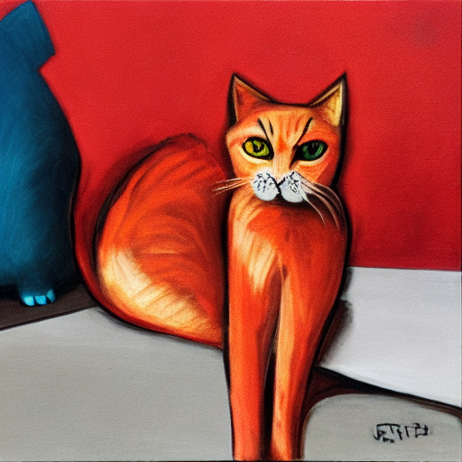

null_edited:

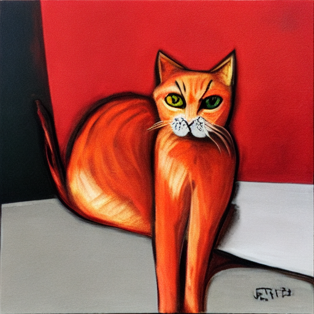

mask:

diff:

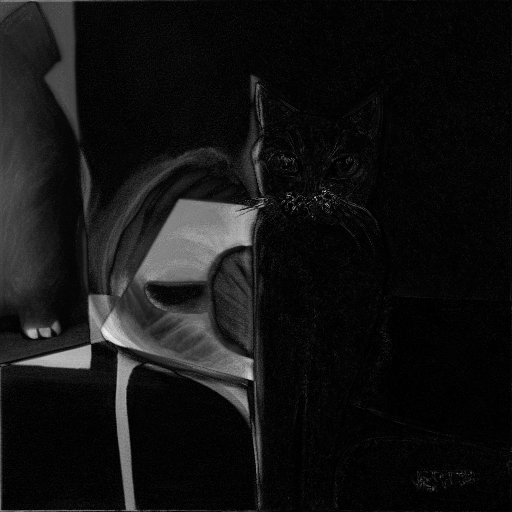

overlay:

#### best_001

- case: 9
- seed: 0
- edit_index: 0
- target: None
- outside_mean_abs_diff_adj: 0.0
- semantic_delta_raw: 0.0447690486907959

Conditions:

- base_prompt: a red ball on the floor
- generate_prompt: a red ball on the floor
- edit_base_prompt: a ball on the floor
- edit_prompt: a green ball
- semantic_text: a green ball
- semantic_neg_text: a red ball
- mask_pad_px: 8
- mask_blur: 8.0
- strength: 0.9
- seed: 0

base_image:

edited:

null_edited:

mask:

diff:

overlay:

#### best_002

- case: 1
- seed: 0
- edit_index: 0
- target: None
- outside_mean_abs_diff_adj: 0.0004303082823753357
- semantic_delta_raw: 0.043653905391693115

Conditions:

- base_prompt: a green dog in a park
- generate_prompt: a green dog in a park
- edit_base_prompt: a dog in a park
- edit_prompt: a yellow dog
- semantic_text: a yellow dog
- semantic_neg_text: a green dog
- mask_pad_px: 8
- mask_blur: 8.0
- strength: 0.9
- seed: 0

base_image:

edited:

null_edited:

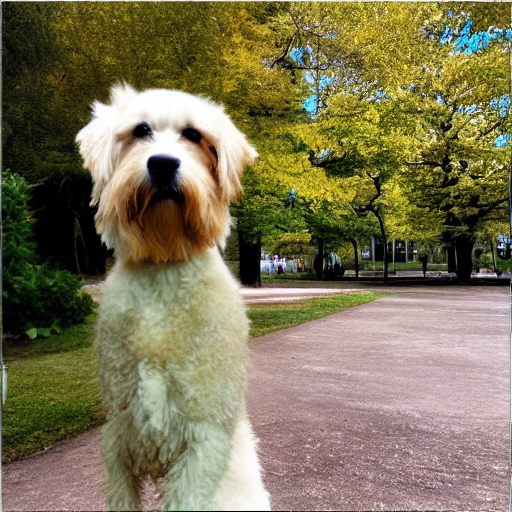

mask:

diff:

overlay:

#### best_003

- case: 5
- seed: 0
- edit_index: 0
- target: None
- outside_mean_abs_diff_adj: 0.0
- semantic_delta_raw: 0.038282185792922974

Conditions:

- base_prompt: a brown chair in a room
- generate_prompt: a brown chair in a room
- edit_base_prompt: a chair in a room
- edit_prompt: a white chair
- semantic_text: a white chair
- semantic_neg_text: a brown chair
- mask_pad_px: 8
- mask_blur: 8.0
- strength: 0.9
- seed: 0

base_image:

edited:

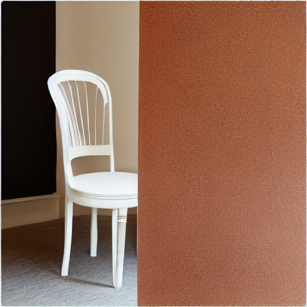

null_edited:

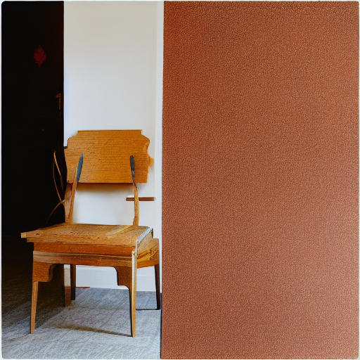

mask:

diff:

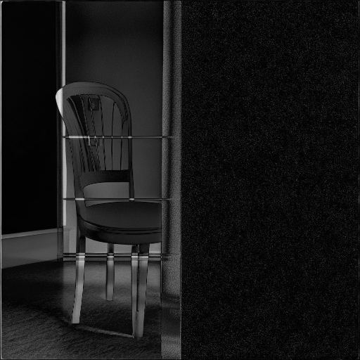

overlay:

#### best_004

- case: 1
- seed: 0
- edit_index: 0
- target: None
- outside_mean_abs_diff_adj: 0.0
- semantic_delta_raw: 0.016071796417236328

Conditions:

- base_prompt: a green dog in a park
- generate_prompt: a green dog in a park
- edit_base_prompt: a dog in a park
- edit_prompt: a yellow dog
- semantic_text: a yellow dog
- semantic_neg_text: a green dog
- mask_pad_px: 8
- mask_blur: 8.0
- strength: 0.6
- seed: 0

base_image:

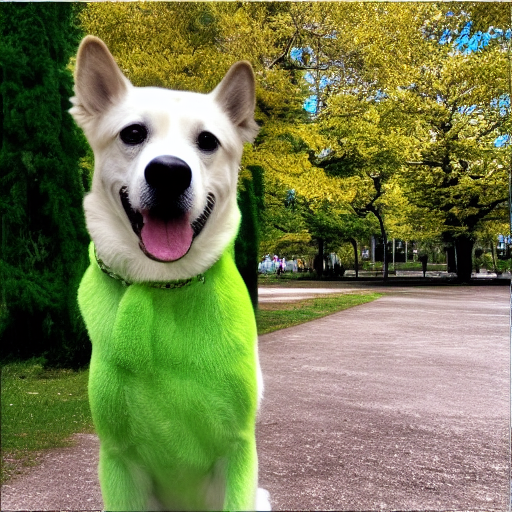

edited:

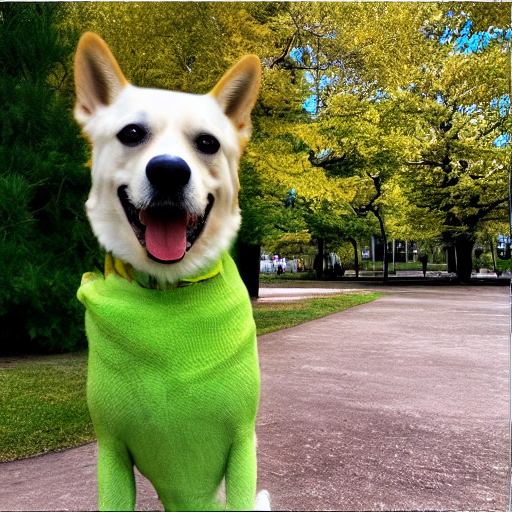

null_edited:

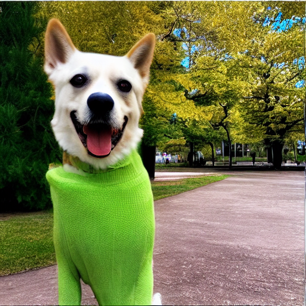

mask:

diff:

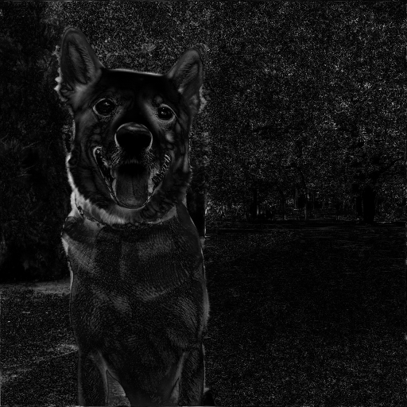

overlay:

